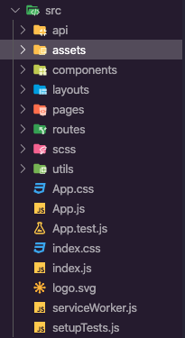

# Proyecto seguro social campesino

## Descripción

Aquí descripción

## Estructura de carpetas

| Nombre     | Descripción                                      |
| ---------- | ------------------------------------------------ |
| api        | Peticiones al backend                            |
| assets     | Recursos de imagenes estaticos                   |
| components | Componentes                                      |
| layouts    | Donde se renderiza las paginas                   |
| pages      | Paginás de la app web                            |
| scss       | Todos los estilos globales                       |
| utils      | Utilidades como constantes, validaciones, iconos |

## Autores

- Aliatis Enzo
- Almagro Dario
- Castro Brangy
- Marquez Griselda
